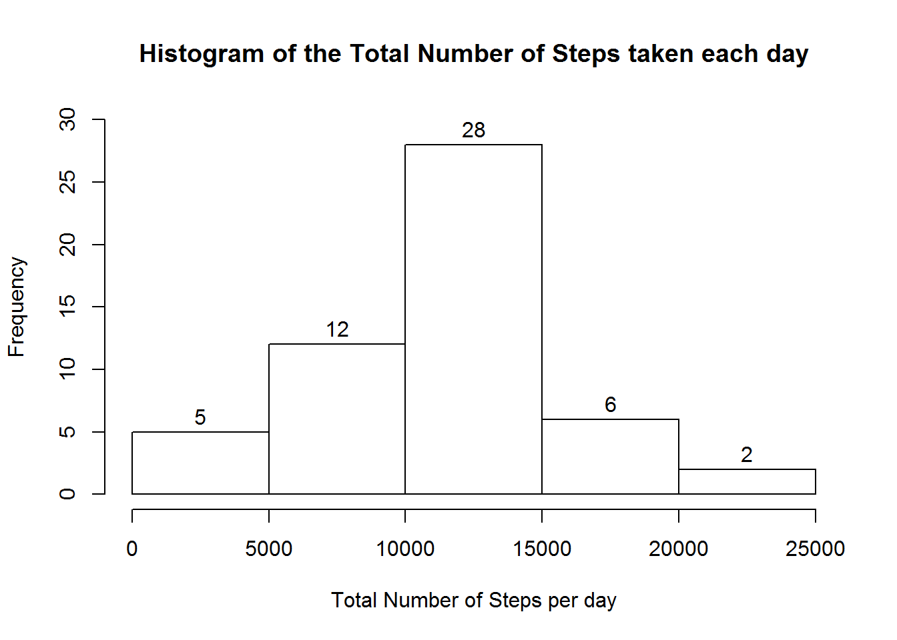
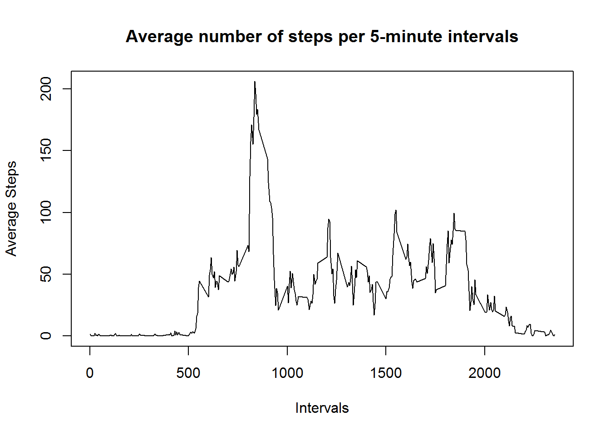
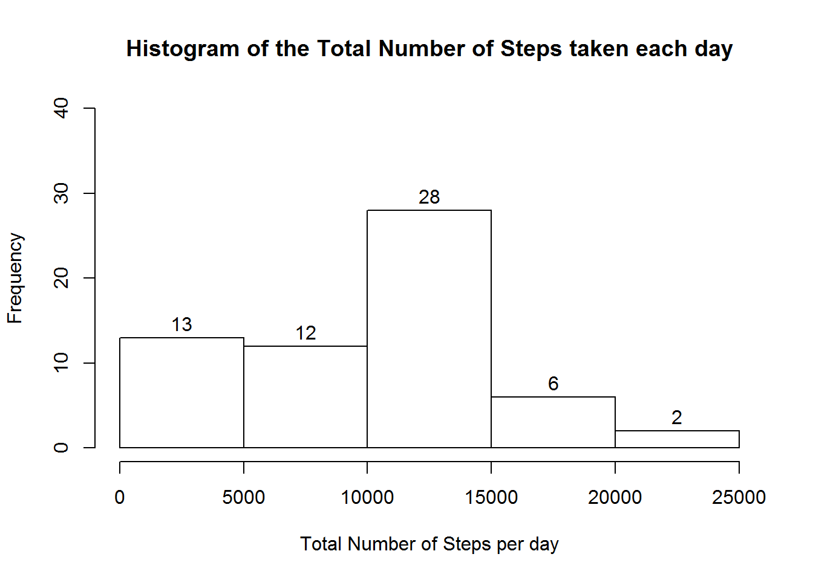
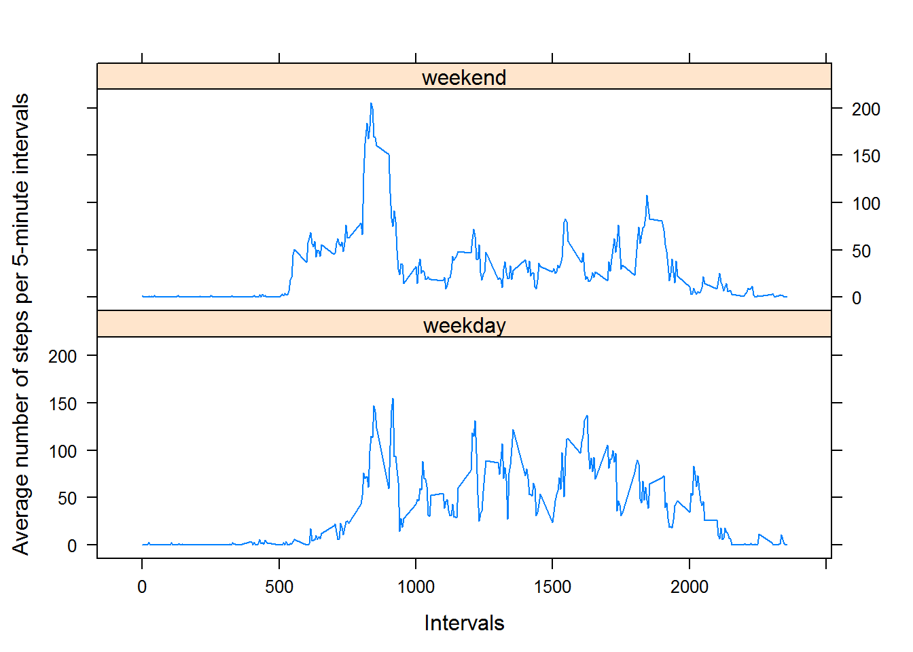

## Loading and preprocessing the data  

1. Load the data (i.e. read.csv())  


```r
# Download activity monitoring data
datafile <- "activity.zip"
if(!file.exists(datafile)) {
    fileURL <- "https://d396qusza40orc.cloudfront.net/repdata%2Fdata%2Factivity.zip"
    download.file(url = fileURL,
                  destfile = datafile, 
                  method = "curl")
}
if(!(file.exists("activity.csv"))) { 
    unzip(datafile) 
}

# Read the data
data <- read.csv("activity.csv", header=TRUE, sep=",", na.strings="NA")
```
  
2. Process/transform the data (if necessary) into a format suitable for the analysis

```r
library(lubridate)
data <- transform(data, date = ymd(date))
```

## What is mean total number of steps taken per day?  

For this part of the assignment, you can ignore the missing values in the dataset.  
1. Calculate the total number of steps taken per day

```r
library(dplyr)
data.aggdate <- group_by(data, date) %>% 
                summarize(steps = sum(steps))
data.aggdate <- na.omit(data.aggdate)
```

2. Make a histogram of the total number of steps taken each day  

```r
hist(data.aggdate$steps, 
     breaks = 5,
     labels=TRUE,
     ylim = c(0,30),
     main="Histogram of the Total Number of Steps taken each day",
     xlab = "Total Number of Steps per day")
```



3. Calculate and report the mean and median of the total number of steps taken per day 


```r
summary(data.aggdate$steps)
```

```
##    Min. 1st Qu.  Median    Mean 3rd Qu.    Max. 
##      41    8841   10765   10766   13294   21194
```

The mean is 10766 and the median is 10765.

## What is the average daily activity pattern?  

1. Make a time series plot (i.e. type = "l") of the 5-minute interval (x-axis) and the average number of steps taken, averaged across all days (y-axis)  


```r
data.aggint <- aggregate(steps ~ interval, data, mean)

plot(x = data.aggint$interval,
     y = data.aggint$steps,
     type = "l",
     xlab = "Intervals",
     ylab = "Average Steps",
     main="Average number of steps per 5-minute intervals")
```



2. Which 5-minute interval, on average across all the days in the dataset, contains the maximum number of steps?  


```r
data.aggint[which.max(data.aggint$steps),]
```

```
##     interval    steps
## 104      835 206.1698
```


## Imputing missing values  

Note that there are a number of days/intervals where there are missing values (coded as NA). The presence of missing days may introduce bias into some calculations or summaries of the data. 

1. Calculate and report the total number of missing values in the dataset (i.e. the total number of rows with NAs)

```r
sum(is.na(data))
```

```
## [1] 2304
```

```r
sum(is.na(data$steps)) / sum(!is.na(data$steps))
```

```
## [1] 0.1509434
```

2. Impute missing values in the dataset using the median value for the 5-minute interval.

```r
library(dplyr)
data.imp <- data %>%
            group_by(interval) %>%
            mutate(median.int = round(median(na.omit(steps))),
                   steps = ifelse(is.na(steps), median.int, steps))
```

3. Calculate and report the mean and median total number of steps taken per day.

```r
# library(dplyr)
data.imp.aggdate <- group_by(data.imp, date) %>% 
                    summarize(steps = sum(steps))

summary(data.imp.aggdate$steps)[3:4]
```

```
##    Median      Mean 
## 10395.000  9503.869
```

4. Make a histogram of the total number of steps taken each day  

```r
hist(data.imp.aggdate$steps, 
     breaks = 5,
     labels = TRUE,
     ylim = c(0,40),
     main="Histogram of the Total Number of Steps taken each day",
     xlab = "Total Number of Steps per day")
```




## Are there differences in activity patterns between weekdays and weekends?  

1. Create a new factor variable in the dataset with two levels - "weekday" and "weekend" indicating whether a given date is a weekday or weekend day.

```r
data.imp <- transform(data.imp, 
            wd.we = factor(
                        ifelse(wday(date, label=F) %in% c(1,7), 
                            "weekday", "weekend")))
```

2. Make a panel plot containing a time series plot (i.e. type = "l") of the 5-minute interval (x-axis) and the average number of steps taken, averaged across all weekday days or weekend days (y-axis). See the README file in the GitHub repository to see an example of what this plot should look like using simulated data.


```r
library(lattice)
data.imp.agg <- aggregate(steps ~ interval + wd.we, data = data.imp, mean)
xyplot(steps ~ interval | wd.we, data = data.imp.agg, 
       type = "l", 
       xlab = "Intervals",
       ylab = "Average number of steps per 5-minute intervals",
       layout = c(1,2))
```




